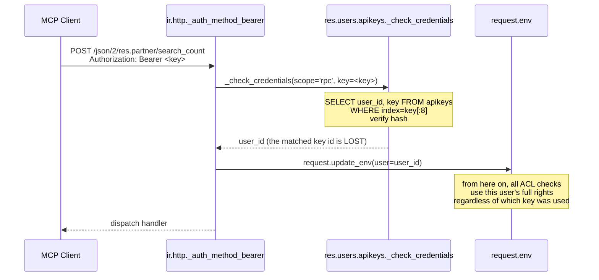
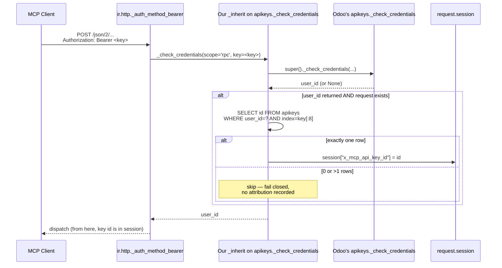

# ADR-006: Per-API-key attribution via patched auth flow (v0.3 strategy)

**Status:** Accepted (proposed 2026-05-18, built and verified 2026-05-19)
**Depends on:** [ADR-005](005-odoo-per-user-billing-constraint.md)
**Implemented in:** v0.3.0; hardened against `/jsonrpc` bypass in v0.4.0

## Context

[ADR-005](005-odoo-per-user-billing-constraint.md) commits the addon to working with one shared Internal User across multiple AI agents. That requires an attribution primitive finer than `res.users.id` — otherwise every agent's calls collapse into one row's worth of `user_id` in the audit log, which is exactly what we observed in pantalytics production.

Odoo's native API key model (`res.users.apikeys`) supports multiple keys per user. The crucial structural problem: Odoo's auth flow throws away the matched key after auth succeeds.

From `odoo/addons/base/models/res_users.py` (19.0):

```python
def _check_credentials(self, *, scope, key):
    for user_id, current_key in self.env.cr.fetchall():
        if key and KEY_CRYPT_CONTEXT.verify(key, current_key):
            return user_id   # ← which key matched is lost here
```

Only `user_id` flows to `request.env`; `api_key_id` is not stored on the session or in the context. Every existing Odoo MCP server in the ecosystem (`tuanle96/mcp-odoo`, `ivnvxd/mcp-server-odoo`, `pantalytics/odoo-mcp-pro`) inherits this collapse — they all use a single API key per server instance and have nothing finer to attribute to.

We sit *inside* Odoo. We can fix this where they cannot.

## How Odoo 19 handles bearer-token auth today



The problem visible in the diagram: between `_check_credentials` and `update_env`, the matched API key's row id never travels. Once `user_id` is set on the env, every downstream check sees the user — never the key.

## Decision (proposed)

In v0.3, ship a small patch on top of OCA `auditlog` that captures the matched API key per request and links it to `mcp.governance.agent.identity`.

Concretely:

1. **Inherit `res.users.apikeys`** and override `_check_credentials` to write the matched key id to `request.session.x_mcp_api_key_id`. Defensive: only when `request` exists (skip cron/CLI paths).
2. **Inherit `auditlog.http.request`** with `x_api_key_id = fields.Many2one("res.users.apikeys", index=True)`. Populate in `create()` from the session attribute.
3. **Add to `mcp.governance.agent.identity`** a `x_api_key_id` field. The smart-button "API Calls" filters on key id, not user id. `x_api_call_count` recomputes accordingly.
4. **Onboarding UI** explains: create one Internal User, create N API keys (one per agent), then create N agent identities each bound to one key.

Total surface: 3 small `_inherit` blocks + view tweaks. Estimated ~150 LOC. No upstream dependencies beyond what v0.2 already has.

### Flow with our override in place



Verified on local Odoo 19 (2026-05-18): two API keys on the same user produced two distinct log entries in `odoo.addons.pan_mcp_pro_governance.models.spike_apikey_attribution`. UI-login path did not trigger the override.

## Consequences

**Positive**
- One paid Odoo user supports N cryptographically-distinguished agents. Honors [ADR-005](005-odoo-per-user-billing-constraint.md).
- The **API key** becomes the identity primitive — server-verified, not client-claimed. Stronger than the self-attestation fallback in [ADR-008](008-context-tagging-fallback.md).
- Revocation is real: revoke a key → that agent loses access immediately, no other agents impacted.
- Differentiator: no other Odoo MCP project has solved this. Becomes a quotable feature in App Store listing and sales material.

**Negative**
- Patches Odoo's native `_check_credentials` (via `_inherit`). If Odoo SA refactors that method in a later 19.x point release, our addon breaks at upgrade. Mitigation: defensive coding (check method signature, fall back gracefully), version pinning, integration test.
- Adds a hidden session attribute (`x_mcp_api_key_id`) that other modules might collide with. Mitigation: namespace prefix (`x_mcp_`) and document the contract.
- Customers must create API keys per agent in the Odoo UI — manual onboarding step. Mitigation: onboarding wizard could automate "create technical user + N keys + N agent identities" in one flow (future).
- Does not solve attribution for non-Odoo-API-key auth paths (OAuth, session-cookie, basic auth from older clients). Those still collapse to user_id. We document this scope.

## Open questions to resolve before promoting Proposed → Accepted

1. Verify `request.session.<attr>` persistence within a single Odoo 19 request when auth is stateless bearer-token. The research suggests it works but needs a manual test on the 19.0 branch.
2. Confirm the OCA `auditlog` 19.0 model `auditlog.http.request` will accept an `_inherit` adding a Many2one without breaking the lazy `current_http_request()` flow.
3. Decide whether the `_check_credentials` patch should be conditional on an admin setting (some customers may want to opt out for performance / safety reasons).
4. Consider whether to upstream this to OCA `auditlog` as a PR instead of carrying our own patch. Upstream-first would benefit the whole community but trades shipping speed.

## Related

- [ADR-008](008-context-tagging-fallback.md) — context-tagging fallback for environments where the patch can't run.
- [research/08](../research/08_api_call_logging_options.md) — initial logging architecture research.
- [research/09](../research/09_mcp_pro_internals.md) — MCP server-side architecture.
