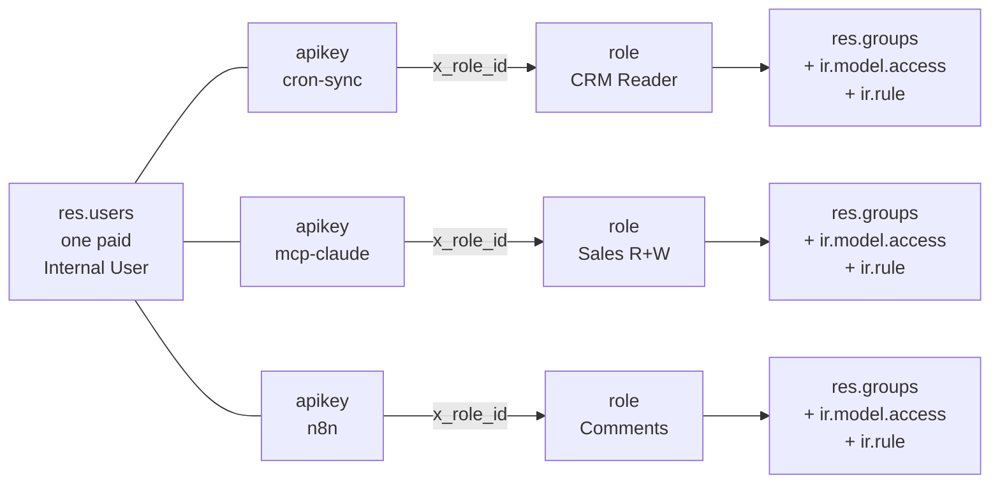
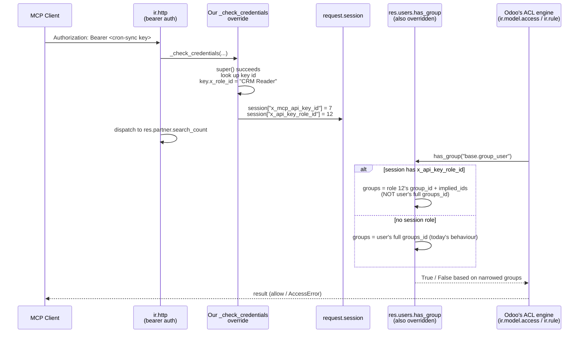

# ADR-010: API key bound to a single OCA user role (supersedes ADR-009)

**Status:** Proposed (2026-05-18)
**Supersedes:** [ADR-009](009-scoped-api-keys.md)
**Depends on:** [ADR-005](005-odoo-per-user-billing-constraint.md), [ADR-006](006-per-api-key-attribution.md), [ADR-007](007-base-user-role-optional-dep.md) *promoted from optional to required dependency*

## Context

[ADR-009](009-scoped-api-keys.md) proposed a custom per-key scope system: fields like `x_scope_model_ids`, `x_scope_methods`, `x_scope_company_ids` on `res.users.apikeys`, enforced by overriding `Model._call_kw`. While this works in principle, it duplicates Odoo's native permission machinery — `res.groups` + `ir.model.access` + `ir.rule` already express exactly the same intent at a different layer.

The architecture diagram drawn by the operator clarifies the cleaner approach:

```
                                      ┌─→ User Roles (OCA) ─→ Access Groups ─→ Access Rights
User ─┬──────────────────────────────┤
      ├── API Key 1 (CRON)  ─────────┤
      └── API Key 2 (MCP)   ─────────┘
```

Each API key binds to **one specific role** out of the user's role bag. The role expands to the same `res.groups` Odoo already knows how to enforce. No new permission system, no parallel ACL — just "this key's session sees the world as if it had only this role's groups."

This is also strictly more expressive than ADR-009 was:

- ADR-009 had `x_scope_methods` as Selection (read / write / create / full). A role can express any of those *and* per-field group restrictions, menu visibility, server action access, multi-company scoping via existing `multi_company.default` — anything Odoo groups can do.
- ADR-009 had `x_scope_model_ids`. A role expresses this via `ir.model.access` rows attached to its `group_id`.
- ADR-009 had `x_scope_domain`. A role expresses this via `ir.rule` rows attached to its `group_id`.

In other words: every dimension ADR-009 was building, Odoo already has. Reusing it is the right move.

## Decision (proposed)

**Make OCA `base_user_role` 19.0 a hard dependency of v0.3+. Bind each `res.users.apikeys` to a single `res.users.role` via a new field. Narrow the request's effective groups to that role for the duration of the request.**

### Data model (minimal)

Extend `res.users.apikeys`:

```python
class ResUsersApikeys(models.Model):
    _inherit = "res.users.apikeys"

    x_role_id = fields.Many2one(
        "res.users.role",
        string="Role",
        help="When this key authenticates a request, the session sees the world "
             "as if the user had ONLY this role's groups — not their full role bag. "
             "Leave empty to inherit the user's full access (legacy / superuser keys).",
        domain="[('id', 'in', user_role_ids)]",
    )
    user_role_ids = fields.Many2many(
        "res.users.role",
        compute="_compute_user_role_ids",
        help="Roles assigned to this key's user — the valid choices for x_role_id.",
    )

    @api.depends("user_id.role_ids")
    def _compute_user_role_ids(self):
        for rec in self:
            rec.user_role_ids = rec.user_id.role_ids

    x_state = fields.Selection(
        [("active", "Active"), ("suspended", "Suspended"), ("revoked", "Revoked")],
        default="active",
    )
    x_last_used = fields.Datetime(readonly=True)
    x_use_count = fields.Integer(readonly=True, default=0)
    x_ip_allowlist = fields.Char(
        help="Optional comma-separated list of CIDRs; empty = no restriction.",
    )
    x_agent_identity_id = fields.Many2one(
        "mcp.governance.agent.identity",
        string="Agent Identity",
    )
```

That's it. **Three semantic fields** (`x_role_id`, `x_state`, `x_agent_identity_id`) and three observability fields. ADR-009 had ten.

### Enforcement layer

Two hooks:

1. **`res.users.apikeys._check_credentials`** override (from [ADR-006](006-per-api-key-attribution.md)). Additional logic:
   - If `x_state != 'active'` → deny.
   - If `x_ip_allowlist` set and `request.httprequest.remote_addr` not in allowed CIDRs → deny.
   - Update `x_last_used`, increment `x_use_count`.
   - If `x_role_id` set → stash `request.session.x_api_key_role_id = key.x_role_id.id`.

2. **`res.users.has_group()`** + **`res.users._get_effective_groups()`** (internal helper used by access-right checks) override. When `request.session.x_api_key_role_id` is set:
   - Resolve the role: `role = self.env["res.users.role"].browse(session.x_api_key_role_id)`.
   - The role's effective groups = `role.group_id | role.group_id.implied_ids | role.implied_ids` (the same expansion `base_user_role.set_groups_from_roles` already does).
   - Substitute this set for `user.groups_id` *for the duration of this request only*. The user's stored `groups_id` is unchanged on disk.

Effect: every `ir.model.access` check, every `ir.rule` evaluation, every `user.has_group(...)` callsite in core Odoo and in any addon transparently sees only the role's groups. Odoo's existing security plumbing does the heavy lifting.

### UI

API key form gets one extra section:

```
┌─ API Key: cron-sync-2026 ─────────────────────────────────┐
│ User: pantalytics-bots@…                ● Active          │
│ Created: 2026-01-15      Last used: 2026-05-18 14:21      │
│ Use count: 4,328         Expires: 2027-01-15              │
│                                                            │
│ Role          [MCP Pro – CRM Reader        ▼]            │
│               └─ implies 3 groups, see role for detail    │
│                                                            │
│ Agent Identity [→ MCP Cron Sync Bot]                      │
│ IP Allowlist   (empty)                                    │
│                                                            │
│ [Suspend] [Revoke] [Rotate key]                           │
└────────────────────────────────────────────────────────────┘
```

The role dropdown is filtered to roles assigned to the owning user — operators can't accidentally bind a key to a role the user doesn't even have.

Smart-button on `mcp.governance.agent.identity` → "API Keys" filtered by `x_agent_identity_id`.

## Consequences

**Positive**
- **Single permission model.** Operators learn one thing: roles. Same vocabulary as the rest of Odoo + OCA RBAC.
- **Reuses battle-tested machinery.** Odoo's access-rights enforcement has been hardened for 15+ years; we don't have to re-implement it.
- **Less code in our addon.** ~50 LOC of model + ~30 LOC of enforcement vs ADR-009's projected ~200 LOC of parallel scope system.
- **No hot-path overhead** in `Model._call_kw`. The group narrowing happens once at auth + once on each `has_group` lookup, which is already heavily cached in Odoo.
- **Expressive ceiling lifted.** Want to restrict to "draft sale orders in Belgium company only"? Define an `ir.rule` on a role's group. Want field-level masking on `partner.email`? Group on the field. Anything Odoo can express, a role can express, a key can therefore inherit.
- **Migration story is clean.** Existing API keys with `x_role_id` empty behave exactly as today — full user access. Operators opt in per key.

**Negative**
- **`base_user_role` becomes a hard dependency.** [ADR-007](007-base-user-role-optional-dep.md) had it optional. This is a behaviour change — customers who don't want OCA RBAC cannot use v0.3+ features. Mitigation: document clearly; the cost of installing `base_user_role` is low and it's well-maintained.
- **Role bag must be pre-populated.** Operator must create at least one role per intended key-scope. There's a chicken-and-egg moment: install our addon → install `base_user_role` → define roles → assign roles to bot user → create keys bound to roles. Onboarding could automate the boring middle.
- **Per-request group override is the only invasive part.** Overriding `has_group` is sensitive — many places in Odoo and addons call it. We need defensive code (only apply when `request.session.x_api_key_role_id` is set AND the request is API-authenticated, never for UI sessions) and broad test coverage.
- **Doesn't help with method-level granularity** beyond what groups express. E.g. "this key can call `crm.lead.action_set_won` but not `crm.lead.action_set_lost`" — not possible with groups, and not with this design either. Almost never needed in practice; out of scope.
- **Edge case: multi-company.** `base_user_role` has a sister module `base_user_role_company` for multi-company. We should test that combination explicitly before promoting Accepted.

## What we drop from ADR-009

- `x_scope_model_ids`, `x_scope_methods`, `x_scope_company_ids`, `x_scope_domain` — all subsumed by the role.
- Custom `Model._call_kw` enforcement — replaced by role-based group narrowing, which uses native ACL checks.
- The "parallel permission system" complaint disappears.

Kept from ADR-009:
- `x_state` (per-key lifecycle).
- `x_last_used` / `x_use_count` (observability — still a gap in Odoo's native API key model).
- `x_ip_allowlist`.
- `x_agent_identity_id` (link to our governance spine).

## Stack after this ADR

### Data model



One paid user, three keys, three roles, three different capability surfaces.

### Request flow



The dotted bit (alt block) is the only invasive piece: the same user, asking the same question, gets different group answers depending on whether the request came via a role-bound API key or via the UI / a plain key.

## Open questions (must resolve before promoting Proposed → Accepted)

1. ~~**Feasibility of per-request group override.**~~ **Resolved 2026-05-18.** Two complementary overrides cover the two main paths:
   - `res.users._has_group()` — handles menu visibility, view-level groups, button gates. When the request authenticated via an API key with a bound role, returns answers based on the role's groups (role.group_id ∪ role.implied_ids ∪ transitive implied groups).
   - `ir.model.access.check()` — handles ORM-level CRUD (search/read/write/create/unlink on models). Same narrowing logic; uses the same role-groups set against `ir_model_access` SQL.
   - `ir.model.access._make_access_error()` — overridden to surface a role-specific error message instead of Odoo's generic "you need group X" pointer (which is misleading when the actual fix is to broaden the role or pick a different one).

   UI sessions are unaffected because `_get_api_key_role()` checks `request.session['x_mcp_api_key_role_id']`, which only the API-key auth path sets.

   Verified locally on Odoo 19.0 with `mcp_v02_test` DB:
   - Role "MCP CRM Reader" (only `group_partner_manager`) on admin's API key
   - `res.partner.search_count` → 4 (allowed by ACL, group_partner_manager has read on res.partner)
   - `ir.module.module.search_count` → AccessError with our role-specific message
   - `has_group("base.group_system")` → False (admin has this group, role does not)
   - `has_group("base.group_partner_manager")` → True

   Not yet covered: `ir.rule` (record-level rules). Filed as a new follow-up.
2. **Should `x_role_id` be required when a key is created on a user that has roles?** Argument for: prevent operators from accidentally creating an unscoped key. Argument against: legacy keys exist; need a soft fallback. Probably: warn in UI, don't hard-require.
3. **Should we surface "effective groups" on the key's form** (read-only computed from `x_role_id.implied_ids`) so operators can answer "what can this key actually do?" without clicking through three models? Probably yes — small UX win.
4. **Interaction with `base_user_role`'s `date_from` / `date_to` time-bound roles.** If a role expires while a key still references it, what happens? Either deny the call or fall back to no-role (full user access). The former is safer; document clearly.
5. **Should we upstream this to OCA `base_user_role`** as `base_user_role_api_key`? Aligns with OCA conventions, benefits ecosystem, slows our shipping. Likely path: ship in our addon, propose to OCA post-validation.

## Why ADR-009 is superseded, not deleted

ADR-009 stays in the repo as Proposed history because:
- It documents the road not taken.
- If `base_user_role` becomes unmaintained or breaks badly in a future Odoo release, ADR-009's parallel-system approach is the fallback.
- It shows future readers why we chose composition over a custom DSL.

## Sources

- Operator's architecture sketch (whiteboard, 2026-05-18) — shows User → User-Roles-OCA → Access-Groups → Access-Rights as the main path, with API keys branching off to that role layer
- [OCA/server-backend `base_user_role` 19.0](https://github.com/OCA/server-backend/tree/19.0/base_user_role)
- [`res_users_role` model source](https://github.com/OCA/server-backend/blob/19.0/base_user_role/models/role.py)
- [`res_users` extension (set_groups_from_roles)](https://github.com/OCA/server-backend/blob/19.0/base_user_role/models/user.py)
- [Airtable PATs scopes reference](https://airtable.com/developers/web/api/scopes) — original inspiration; we kept the *intent* (per-token capability surface) but mapped it to Odoo's native role/group vocabulary instead of inventing parallel scope strings
